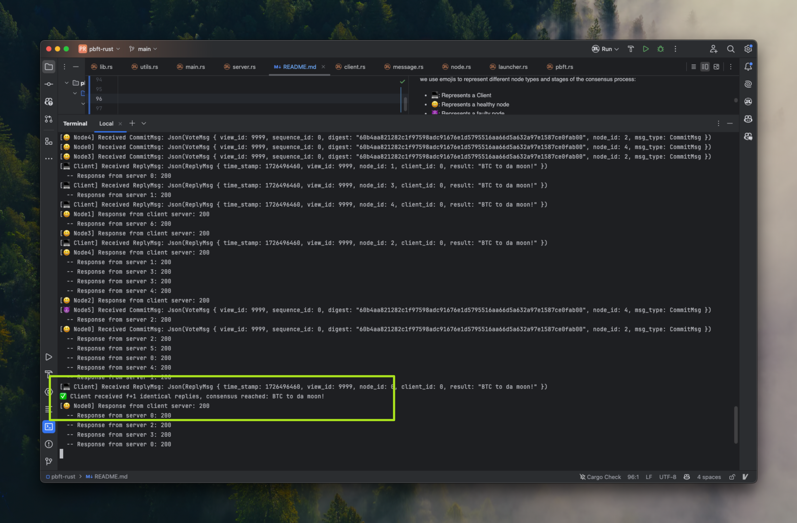

# pbft-rust 🦀
This project provides a Rust-based implementation of the 
Practical Byzantine Fault Tolerance (PBFT) consensus algorithm, 
inspired by the original paper by Miguel Castro and Barbara Liskov, 
“Practical Byzantine Fault Tolerance”.

The implementation simulates a distributed environment with multiple threads 
representing both clients and consensus nodes (servers). 
Clients initiate transaction requests to the consensus nodes, which then reach agreement using the PBFT algorithm and return the result to the client.


**Key assumptions in this implementation:**
- The client listens on port 9000 by default.
- Consensus nodes listen on ports starting from 8000 and increment by one for each additional node.
- Faulty nodes are modeled by not responding to any requests during the consensus process, simulating a node failure.

**Project Structure:**
```
src/
├── main.rs              # Main entry point
├── lib.rs               # Library module
├── consensus/           # Consensus-related code
│   ├── message.rs       # Message structures
│   ├── pbft.rs          # Stage definitions
├── network/             # Networking code
│   ├── client.rs        # Client logic
│   ├── node.rs          # Consensus node logic
│   ├── server.rs        # Server-related code
├── utils/               # Utility functions
```
## Getting Started
**1. Clone the repository.**
```bash
git clone https://github.com/0xjeffro/pbft-rust.git
cd pbft-rust
```


**2. Run the following command to start the server.**
```bash
cargo run -- -n <num_nodes> -f <num_faulty_nodes>
```
Replace <num_nodes> with the total number of nodes in the network and <num_faulty_nodes> with the number of faulty nodes.


**3. Send requests to the client.**
In a separate terminal, use the following command to send a request:
```bash
curl -H "Content-Type: application/json" -X POST -d '{"client_id":0, "operation":"BTC to da moon!", "time_stamp":1726496460,"sequence_id":8}' http://localhost:9000/req
```
Replace `client_id`, `operation`, `time_stamp`, and `sequence_id` with the appropriate values as needed for your request.

## Log Output
During execution, logs are output to the console. To make it easier to understand the state and behavior of the nodes, 
we use emojis to represent different node types and stages of the consensus process:
- 💻: Represents a Client
- 😃: Represents a healthy node
- 😈: Represents a faulty node
- 🌟: Indicates transition to the PrePrepare stage
- 🌟🌟: Indicates transition to the Prepare stage
- 🌟🌟🌟: Indicates transition to the Commit stage
- ✅: Indicates the client has received f+1 identical replies, and consensus has been reached

## Examples

### Successful Consensus
```bash
cargo run -- -n 7 -f 2
```
```bash
curl -H "Content-Type: application/json" -X POST -d '{"client_id":0, "operation":"BTC to da moon!", "time_stamp":1726496460,"sequence_id":8}' http://localhost:9000/req
```



### Failed to Reach Consensus
```bash
cargo run -- -n 4 -f 2
```
```bash
curl -H "Content-Type: application/json" -X POST -d '{"client_id":0, "operation":"BTC to da moon!", "time_stamp":1726496460,"sequence_id":8}' http://localhost:9000/req
```


